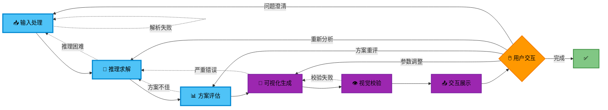
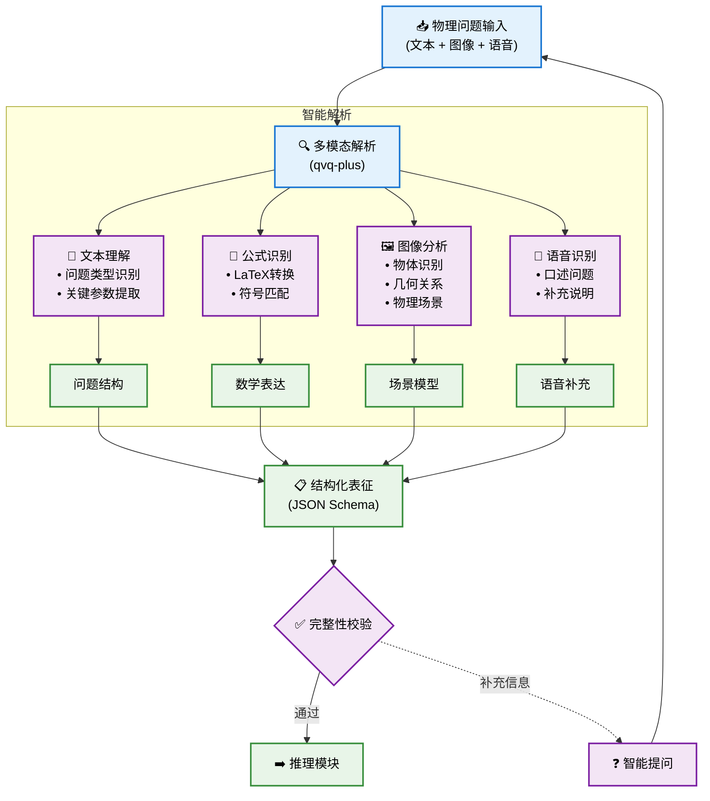
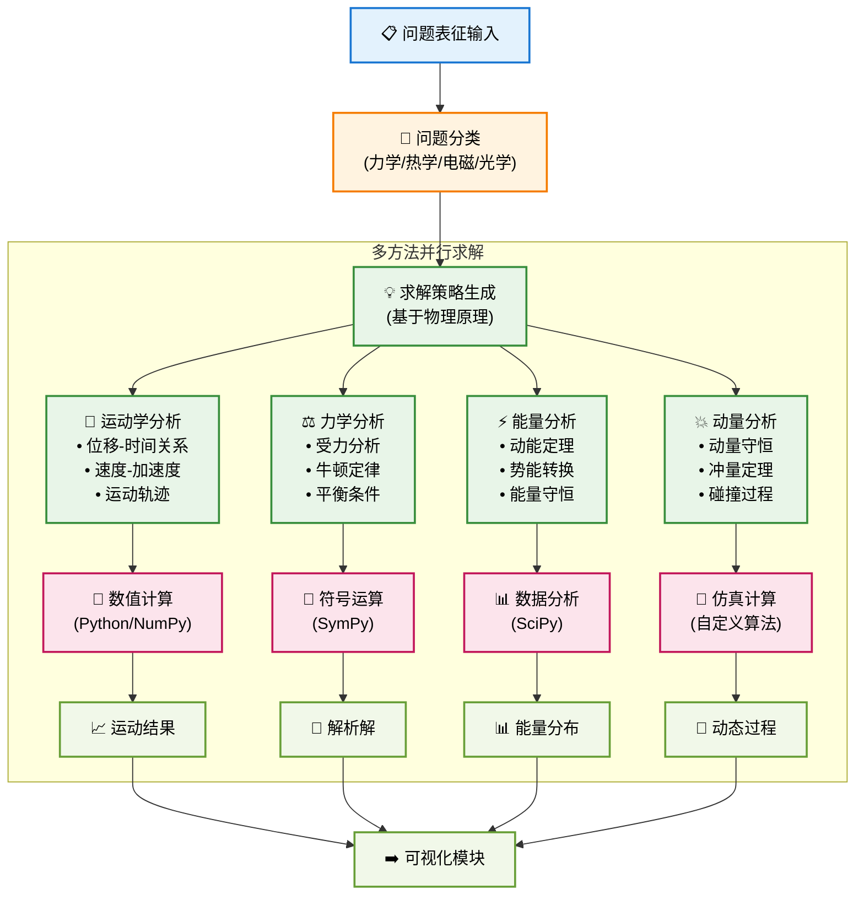
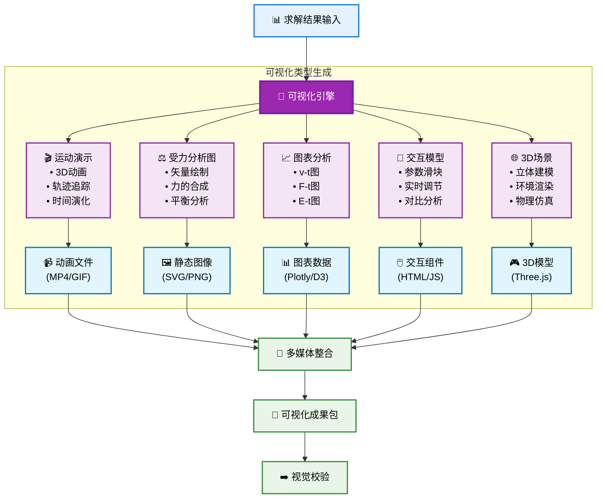
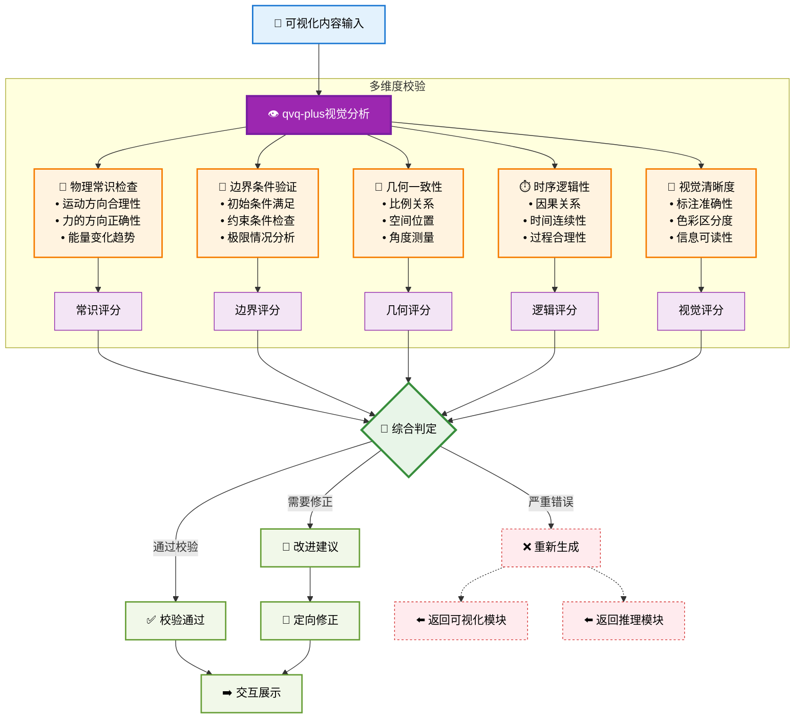
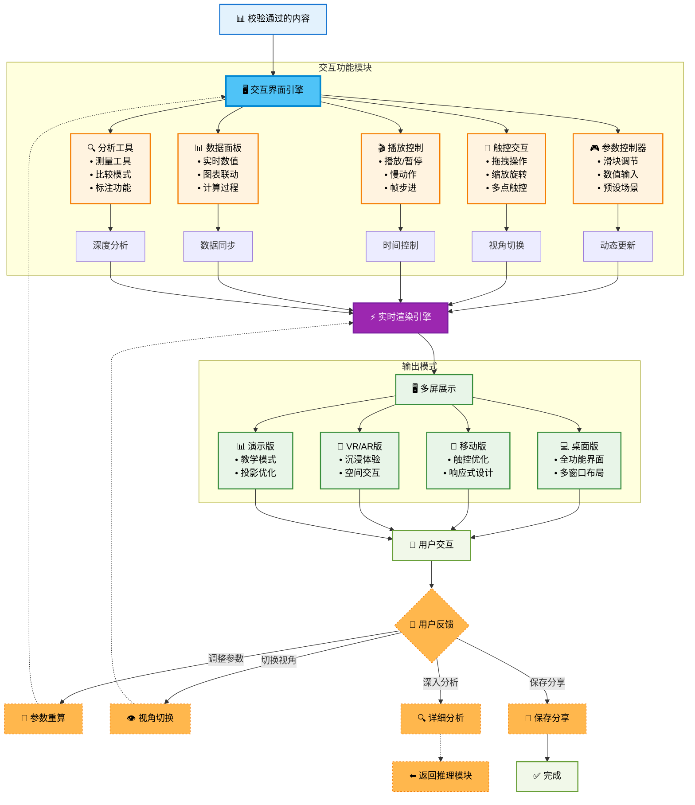
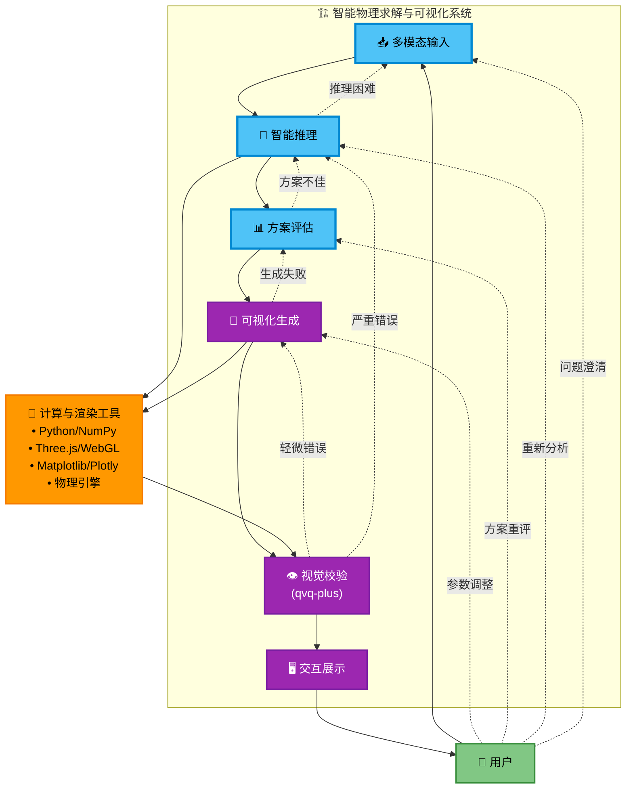

# 交互式物理问题求解智能体构建计划 (v3)

## 1. 核心理念与目标

本计划旨在构建一个能够理解和解决复杂物理问题的交互式可视化智能体，以取代传统搜题软件。核心思路是结合多模态大语言模型（`qvq-plus` 用于视觉理解和校验，`qwen-plus` 用于核心推理）与外部计算工具，通过高质量的可视化和交互体验，为用户提供直观的物理问题理解和求解过程。

**目标用户**: 学生、教师、物理爱好者。
**核心创新**:
*   **交互式可视化**: 提供动态运动演示、实时受力分析图等多种可视化形式
*   **智能视觉校验**: 利用qvq-plus对生成的可视化内容进行常识性和物理准确性验证
*   **实时参数调节**: 用户可通过滑块、输入框等交互方式调整参数，实时观察结果变化
*   **多平台适配**: 支持桌面、移动端、VR/AR等多种交互模式
*   **沉浸式体验**: 通过3D建模、物理仿真等技术提供比传统搜题软件更优的用户体验

**核心能力**:
*   准确理解包含文本、公式和图像的物理问题
*   生成多种求解思路并进行智能评估
*   创建高质量的动态可视化内容（运动演示、受力分析图等）
*   利用qvq-plus进行可视化内容的智能校验
*   提供交互式的参数调节和实时计算
*   支持多种交互模式和展示平台

## 2. 系统架构与模块

智能体将主要由以下几个模块构成：

### 2.1. 问题理解与表征模块
*   **输入**: 物理题目（文本描述 + 图像/示意图 + 语音描述）。
*   **模型**: `qvq-plus` (多模态理解模型)。
*   **功能**:
    *   **智能多模态解析**: 
        *   **文本理解**: 问题类型识别、关键参数提取、语义分析。
        *   **公式识别**: LaTeX转换、符号匹配、数学表达式解析。
        *   **图像分析**: 物体识别、几何关系理解、物理场景建模。
        *   **语音识别**: 口述问题理解、补充说明处理。
    *   **智能提问**: 当信息不完整时，自动生成澄清问题。
*   **输出**: 结构化的JSON对象，包含完整的问题表征和物理场景模型。
*   **创新点**: 支持多模态输入，智能补全缺失信息。

### 2.2. 核心推理与求解模块（无RAG纯推理）
*   **输入**: 结构化的问题表征。
*   **模型**: `qwen-plus` (文本推理模型)。
*   **功能**:
    1.  **问题分类与策略生成**:
        *   基于物理原理的纯推理（无需外部知识库支撑）
        *   多方法并行：运动学分析、力学分析、能量分析、动量分析。
    2.  **计算引擎集成**:
        *   **数值计算**: Python/NumPy进行精确计算。
        *   **符号运算**: SymPy处理解析解。
        *   **数据分析**: SciPy进行复杂分析。
        *   **物理仿真**: 自定义算法模拟动态过程。
    3.  **多方案生成**: 同时产生多种有效的求解路径。
*   **输出**: 多种求解方案的完整推理过程和计算结果。
*   **优势**: 完全无需外部知识库，基于模型内置物理知识的直接推理。

### 2.3. 方案评估与整合模块
*   **输入**: 来自核心推理模块的多种求解方案。
*   **模型**: `qwen-plus` 承担评估任务。
*   **功能**:
    *   **多维度评估**:
        *   **正确性**: 物理一致性、逻辑自洽性、边界条件验证
        *   **效率性**: 解法步骤简洁性、计算复杂度
        *   **可解释性**: 推理过程清晰度、物理直觉
    *   **方案选择/融合**:
        *   选出最优解法，或对多个有效解法进行综合展示
        *   分析问题原因，触发重试或用户澄清
*   **输出**: 最终推荐的解答、评估摘要、置信度评分。

### 2.4. 交互式可视化生成模块（核心创新）
*   **输入**: 求解结果和物理模型数据。
*   **核心引擎**: 多类型可视化生成器。
*   **功能**:
    *   **动态演示生成**:
        *   3D动画制作（轨迹追踪、时间演化）
        *   运动过程可视化（位移、速度、加速度变化）
        *   物理现象仿真（碰撞、振动、波动等）
    *   **受力分析图**:
        *   智能矢量绘制（力的大小、方向、作用点）
        *   力的合成与分解可视化
        *   平衡态分析图
    *   **交互式图表**:
        *   实时v-t、F-t、E-t图表
        *   参数滑块控制
        *   多场景对比分析
    *   **3D场景构建**:
        *   立体物理环境建模
        *   真实感渲染
        *   空间关系可视化
*   **技术栈**: Three.js、WebGL、Plotly、D3.js、物理引擎
*   **输出**: 多媒体可视化内容包（动画、图表、3D模型、交互组件）

### 2.5. 智能视觉校验模块（qvq-plus核心应用）
*   **输入**: 生成的可视化内容（图像、动画、3D场景）。
*   **模型**: `qvq-plus` (视觉分析与理解模型)。
*   **多维度校验**:
    *   **物理常识检查**: 运动方向合理性、力的方向正确性、能量变化趋势
    *   **边界条件验证**: 初始条件满足、约束条件检查、极限情况分析
    *   **几何一致性**: 比例关系、空间位置、角度测量准确性
    *   **时序逻辑性**: 因果关系、时间连续性、过程合理性
    *   **视觉清晰度**: 标注准确性、色彩区分度、信息可读性
*   **智能反馈与错误恢复**:
    *   **通过校验**: 直接进入交互展示环节
    *   **轻微错误**: 提供具体改进建议，定向修正可视化内容
    *   **严重错误**: 识别根本性物理逻辑问题，触发返回推理模块重新分析
    *   **逻辑冲突**: 发现问题理解偏差，返回输入处理模块重新解析
*   **创新点**: 首次将视觉AI用于物理可视化内容的自动质量控制，并建立完整的错误恢复机制

### 2.6. 交互展示与用户体验模块
*   **输入**: 校验通过的多媒体内容。
*   **核心**: 实时交互引擎。
*   **交互功能**:
    *   **参数控制器**: 滑块调节、数值输入、预设场景切换
    *   **视角控制**: 拖拽操作、缩放旋转、多点触控支持
    *   **播放控制**: 播放/暂停、慢动作、帧步进、循环播放
    *   **数据面板**: 实时数值显示、图表联动、计算过程展示
    *   **分析工具**: 测量工具、比较模式、标注功能
*   **多平台适配**:
    *   **桌面版**: 全功能界面、多窗口布局
    *   **移动版**: 触控优化、响应式设计
    *   **VR/AR版**: 沉浸体验、空间交互
    *   **演示版**: 教学模式、投影优化
*   **用户体验**: 实时渲染、流畅交互、直观操作

### 2.6. 错误处理与反馈机制
*   **视觉校验失败处理**: 
    *   **轻微错误**: 定向修正，重新生成可视化内容
    *   **严重错误**: 返回推理模块，重新分析求解过程
    *   **逻辑错误**: 返回问题理解模块，重新解析问题表征
*   **用户反馈处理**: 
    *   **参数调整**: 实时重新计算和渲染
    *   **方法质疑**: 触发多方案重新评估
    *   **结果异议**: 返回推理步骤进行重新分析
*   **智能优化**: 通过失败案例和用户行为持续改进系统性能

## 3. 迭代开发与学习流程

### 3.1 整体架构概览

首先展示智能体的整体工作流程：

### 3.2 输入处理模块详解

### 3.3 推理求解模块详解（移除RAG）

### 3.4 可视化生成模块详解（核心创新）

### 3.5 视觉校验模块详解（qvq-plus核心功能）

### 3.6 交互展示模块详解（用户体验核心）

### 3.7 完整系统交互图（重新设计）

这种分段细化的方法有以下优势：

1. **渐进式理解**：从整体概览到详细实现
2. **模块化设计**：每个组件都有清晰的职责边界
3. **易于开发**：可以按模块逐步实现和测试
4. **便于维护**：问题定位和优化更加精准
5. **灵活扩展**：可以独立升级某个模块而不影响整体

## 4. 核心创新总结

### 4.1 技术创新点

1. **多模态智能解析**：利用qvq-plus实现文本、图像、语音的统一理解
2. **无RAG直接推理**：基于物理原理的直接推理，减少外部依赖
3. **交互式可视化**：实时3D动画、受力分析图、参数调节等多种形式
4. **智能视觉校验**：首次将视觉AI用于物理可视化内容的质量控制
5. **多平台交互**：支持桌面、移动、VR/AR等多种交互模式

### 4.2 用户体验优势

1. **沉浸式学习**：通过3D建模和物理仿真提供直观的物理现象展示
2. **实时交互**：参数滑块、视角控制等实时调节功能
3. **多维度理解**：同时提供运动演示、受力分析、图表分析等多种视角
4. **智能校验**：自动检测可视化内容的物理合理性和视觉清晰度
5. **个性化适配**：根据不同平台和使用场景提供优化的交互体验

### 4.3 与传统搜题软件的区别

| 特性 | 传统搜题软件 | 本智能体 |
|------|-------------|----------|
| 交互方式 | 静态文本+图片 | 动态3D可视化+实时交互 |
| 理解能力 | 文本匹配 | 多模态智能理解 |
| 求解方式 | 题库检索 | 基于物理原理的推理 |
| 可视化 | 简单图表 | 3D动画+受力分析+交互模型 |
| 质量控制 | 人工审核 | AI视觉校验 |
| 学习体验 | 被动接受 | 主动探索+参数调节 |

这个智能体将彻底改变物理问题求解的体验，从传统的"搜题-看答案"模式转向"理解-探索-验证"的沉浸式学习模式。

