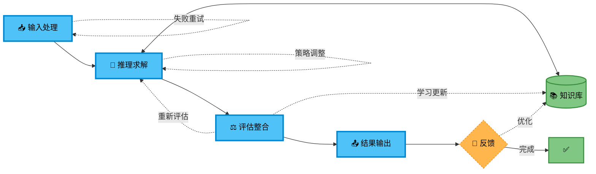
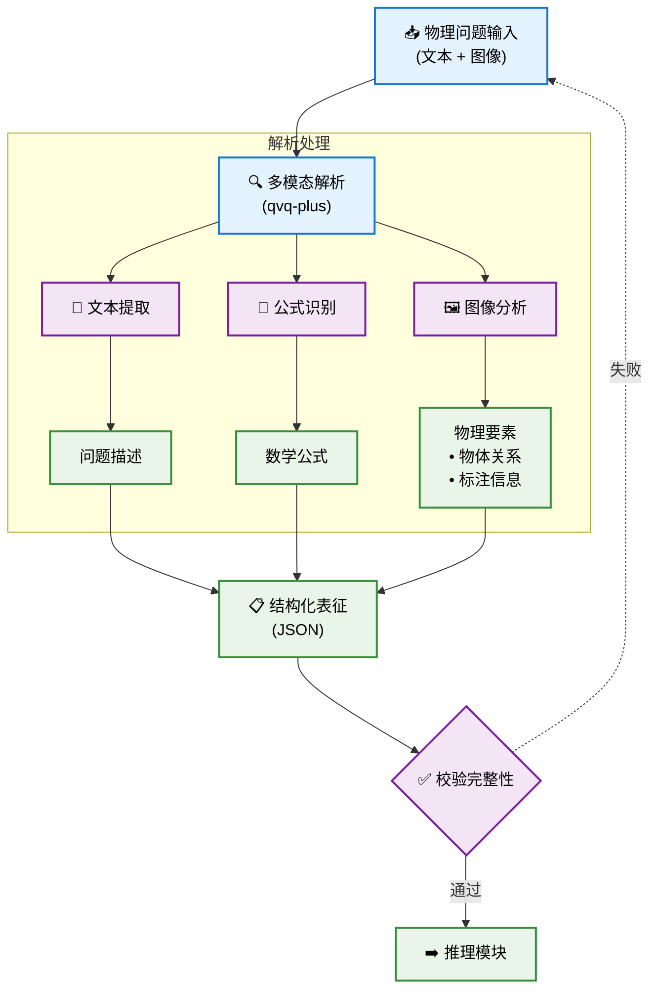
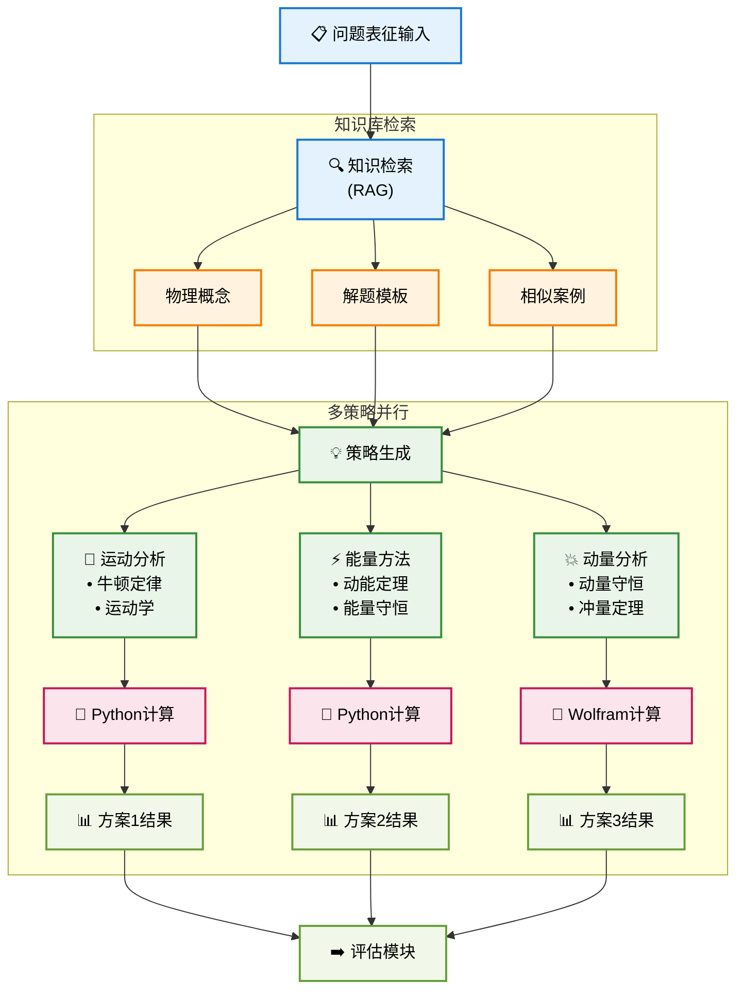
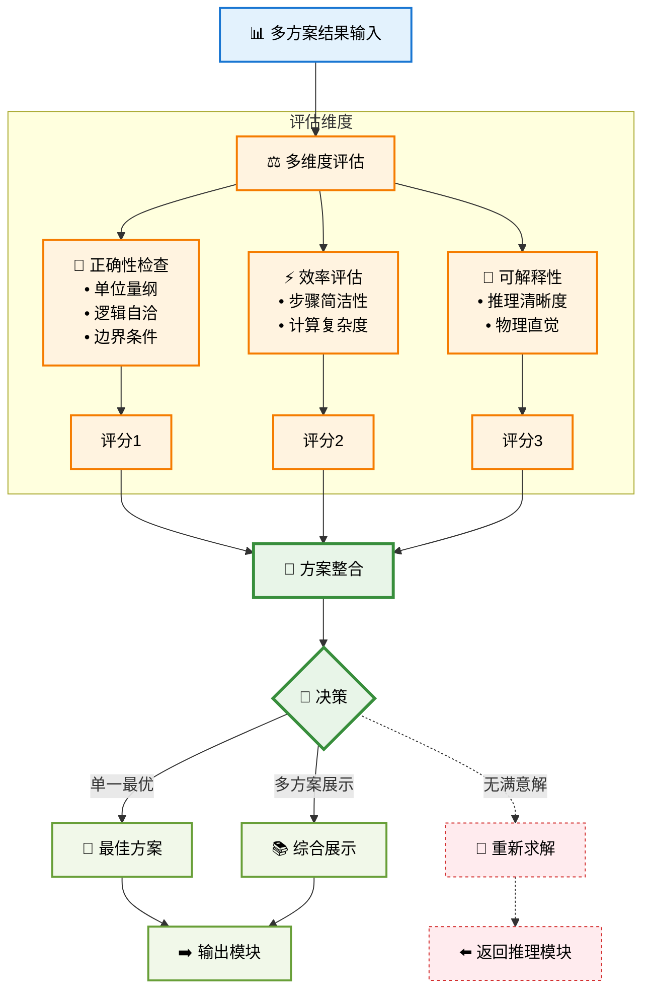
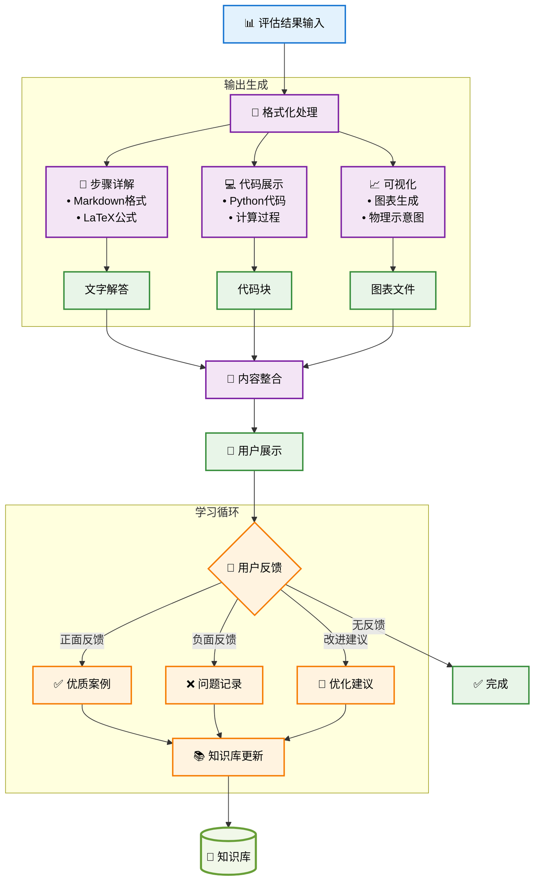
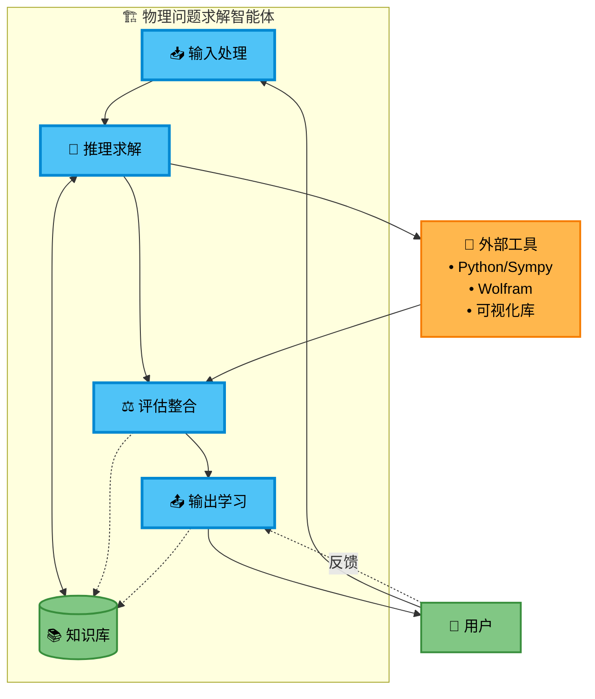

# 解决物理问题的智能体构建计划 (v2)

## 1. 核心理念与目标

本计划旨在构建一个能够理解和解决复杂物理问题的智能体。核心思路是结合多模态大语言模型（如 `qvq-plus` 用于视觉理解，`qwen-plus` 用于核心推理）与外部计算工具（Python, Sympy, Wolfram Mathematica）和一个持续迭代的知识库，以实现高精度、可解释的物理问题求解。

**目标用户**: 学生、教师、物理爱好者。
**核心能力**:
*   准确理解包含文本、公式和图像的物理问题。
*   生成多种求解思路并进行评估。
*   执行必要的数值和符号计算。
*   提供清晰的解题步骤和可视化结果。
*   通过与知识库的交互和用户反馈持续学习和改进。

## 2. 系统架构与模块

智能体将主要由以下几个模块构成：

### 2.1. 问题理解与表征模块
*   **输入**: 物理题目（文本描述 + 图像/示意图）。
*   **模型**: `qvq-plus` (或类似的多模态模型)。
*   **功能**:
    *   **文本提取**: 准确提取题目中的所有文字信息。
    *   **公式识别**: 识别并抽取出 LaTeX 或其他标准格式的数学公式。
    *   **图像/示意图分析**:
        *   识别图像中的关键物体、部件及其标签。
        *   理解物体间的空间关系、连接方式、接触状态。
        *   识别物理状态的表征，如速度矢量、力矢量、运动轨迹示意等。
        *   提取图中标注的已知量和待求量。
*   **输出**: 结构化的JSON对象，包含：
    *   `problem_text`: 原始或清洗后的题目文本。
    *   `extracted_formulas`: 公式列表 (e.g., `["E=mc^2", "F=ma"]`)。
    *   `image_elements`: 图像中识别出的物体及其属性 (e.g., `[{"label": "block_A", "mass": "m1", "on_surface": "inclined_plane"}, ...]`)。
    *   `image_relationships`: 物体间的关系 (e.g., `["block_A contacts block_B", "spring_1 connects to block_A"]`)。
    *   `diagram_annotations`: 图中标注的符号及其含义。
*   **优化**: 针对物理场景优化提示工程，确保 `qvq-plus` 输出的准确性和全面性。考虑对输出进行校验和可能的澄清环节。

### 2.2. 核心推理与求解模块
*   **输入**: 结构化的问题表征。
*   **模型**: `qwen-plus` (或类似的强文本推理模型)。
*   **功能**:
    1.  **知识库检索 (RAG)**:
        *   根据问题表征，从知识库中检索相关的物理概念、核心公式、基本定理、解题模板和相似已解题目。
    2.  **求解策略生成**:
        *   基于检索到的知识和问题本身，生成多种可能的求解路径/策略（例如，牛顿定律、能量守恒、动量守恒、运动学分析等）。
        *   允许模型自主探索或通过预设的元提示（meta-prompts）引导生成不同类型的解法。
    3.  **步骤分解与执行**:
        *   将每个求解策略分解为详细的逻辑步骤和计算任务。
        *   **调用计算工具**:
            *   **Python (Sympy, Numpy, Scipy)**: 对于需要精确数值计算或复杂符号运算（如解方程组、求导、积分）的步骤，LLM生成相应的Python代码，并在沙箱环境中执行，获取结果。
            *   **Wolfram Mathematica (可选)**: 对于更高级的符号计算或特定函数库需求。
        *   LLM负责解释计算工具的输出，并将其整合回推理链条。
*   **输出**: 每种求解策略的完整推理过程、中间步骤、调用的代码、计算结果和最终答案。

### 2.3. 结果评估与整合模块
*   **输入**: 来自核心推理模块的多种求解方案。
*   **模型**: 可由 `qwen-plus` 承担，或设计专门的评估模型/规则集。
*   **功能**:
    *   **多维度评估**:
        *   **正确性**:
            *   **物理一致性**: 单位检查、量纲分析。
            *   **逻辑自洽性**: 步骤间推导是否正确，有无矛盾。
            *   **边界/特例检验**: 在极端或简化条件下，结果是否符合物理直觉。
            *   **与已知条件吻合度**: 结果是否与题目所有给定条件兼容。
        *   **效率与简洁性**: 解法步骤是否最少，有无更直接的路径。
        *   **可解释性**: 推理过程是否清晰、易于理解。
        *   **知识库对齐**: 与知识库中高质量解法的相似度和一致性。
    *   **方案选择/融合**:
        *   选出最优解法，或对多个有效解法进行综合展示。
        *   如果所有解法均存在问题，系统应能分析可能的原因，并触发重试（调整策略）或向用户请求澄清。
*   **输出**: 最终推荐的解答（含详细步骤）、对不同解法的评估摘要、置信度评分。

### 2.4. 知识库模块
*   **目标**: 存储和管理物理知识、解题经验，支持智能体的学习和迭代。
*   **内容**:
    *   **物理概念库**: 定义、公式、适用条件、相关定理。
    *   **问题库**: 结构化存储的物理题目及其标准表征。
    *   **解法库**: 经过验证的高质量解题方案，包括详细步骤、涉及的公式、使用的计算代码、解题技巧和常见错误。
    *   **评估反馈库**: 存储对不同解法的评估结果和用户反馈。
*   **技术选型**: 考虑使用矢量数据库（如FAISS, Milvus）进行相似题目/解法检索，图数据库（如Neo4j）管理概念间关系，或结合结构化文件存储。
*   **更新机制**:
    *   **自动入库**: 经评估模块验证为高质量的新解法自动加入。
    *   **失败案例记录**: 记录不成功的尝试及其原因，用于避免重复错误和优化策略。
    *   **用户反馈整合**: 将用户对解答的评价（正确性、清晰度等）纳入，用于调整评估标准和解法权重。

### 2.5. 输出与可视化模块
*   **输入**: 最终的解答和解题过程。
*   **功能**:
    *   **格式化输出**: 以Markdown、LaTeX等易读格式呈现解题步骤、公式、最终答案。
    *   **代码展示**: 清晰展示用于计算的Python或其他代码。
    *   **可视化生成**:
        *   调用Python库（Matplotlib, Seaborn）或Wolfram Mathematica生成图表（如受力图、运动轨迹图、数据图）。
        *   LLM可生成相应的可视化代码。
*   **输出**: 用户友好的、包含文本、公式、代码和可视化图表的完整解答。

## 3. 迭代开发与学习流程

### 3.1 整体架构概览

首先展示智能体的整体工作流程：

### 3.2 输入处理模块详解

### 3.3 推理求解模块详解

### 3.4 评估整合模块详解

### 3.5 输出与学习模块详解

### 3.6 完整系统交互图

这种分段细化的方法有以下优势：

1. **渐进式理解**：从整体概览到详细实现
2. **模块化设计**：每个组件都有清晰的职责边界
3. **易于开发**：可以按模块逐步实现和测试
4. **便于维护**：问题定位和优化更加精准
5. **灵活扩展**：可以独立升级某个模块而不影响整体

